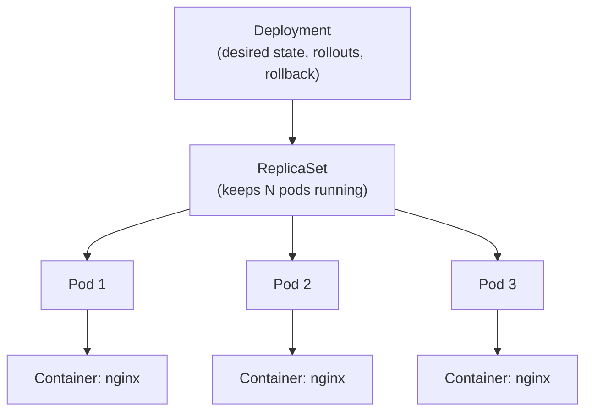

# Kubernetes Notes: Day 3

## Table of Contents

1. [Container vs Pod vs Deployment](#1-container-vs-pod-vs-deployment)
2. [Best Practice](#2-best-practice)
3. [What is a ReplicaSet?](#3-what-is-a-replicaset)
4. [What is a Deployment?](#4-what-is-a-deployment-in-detail)
5. [Deployment vs ReplicaSet](#5-deployment-vs-replicaset)
6. [Image, Label, Selector, Replica Explained](#6-image-label-selector-and-replica-explained)
7. [deployment.yml Explained Line by Line](#7-deploymentyml-explained-line-by-line)
8. [Deployment Commands](#8-deployment-commands)
9. [Hands-on Walkthrough](#9-hands-on-walkthrough)
10. [Quick Cheat Sheet](#10-quick-cheat-sheet)

---

## 1. Container vs Pod vs Deployment

These three are **layers**, each one wrapping the one before it and adding more capability.

| Level | What it is | Who manages it | What it gives you |
|---|---|---|---|
| **Container** | A running instance of an image (your app plus its dependencies) | Container runtime (containerd, CRI-O, Docker) | Isolation and packaging |
| **Pod** | The smallest deployable unit in Kubernetes; **wraps one or more containers** | Kubernetes (kubelet runs it) | Shared IP, shared storage, shared lifecycle |
| **Deployment** | A **controller** that manages Pods through a ReplicaSet | Kubernetes controller-manager | Replicas, self-healing, scaling, rolling updates, rollback |

### 1.1 Diagram: The Layers

```
+----------------------------------------------------------------------------+
|  DEPLOYMENT   (desired state: "I want 3 copies of nginx:1.25 running")     |
|  Provides: self-healing, scaling, rolling updates, rollback                |
|                                                                            |
|   +----------------------------------------------------------------------+ |
|   |  REPLICASET   (keeps exactly 3 Pods alive at all times)              | |
|   |                                                                      | |
|   |   +-------------+     +-------------+     +-------------+            | |
|   |   |    POD 1    |     |    POD 2    |     |    POD 3    |            | |
|   |   | +---------+ |     | +---------+ |     | +---------+ |            | |
|   |   | |Container| |     | |Container| |     | |Container| |            | |
|   |   | | (nginx) | |     | | (nginx) | |     | | (nginx) | |            | |
|   |   | +---------+ |     | +---------+ |     | +---------+ |            | |
|   |   +-------------+     +-------------+     +-------------+            | |
|   +----------------------------------------------------------------------+ |
+----------------------------------------------------------------------------+
```

**Ownership chain:** `Deployment` creates and owns a `ReplicaSet`, the `ReplicaSet` creates and owns the `Pods`, and each `Pod` runs one or more `Containers`.



### 1.2 What Happens When Something Fails?

| Scenario | Plain Container (Docker) | Standalone Pod | Deployment |
|---|---|---|---|
| App process crashes | Restarts only if a restart policy is set | kubelet restarts the container (per `restartPolicy`) | Same, plus the ReplicaSet watches Pod count |
| Pod is deleted by mistake | Gone | **Gone, not recreated** | **ReplicaSet creates a new Pod automatically** |
| Node (machine) dies | Gone | **Gone, not rescheduled** | **Pods recreated on healthy nodes** |
| Need more copies | Run more containers by hand | Create more Pods by hand | Change `replicas: 5` |
| Update to a new version | Stop and start manually (downtime) | Delete and recreate (downtime) | **Rolling update with zero downtime** |
| Roll back a bad release | Manual | Manual | `kubectl rollout undo` |

### 1.3 Analogy

- **Container** = a single worker doing a job
- **Pod** = the worker's desk, with an address and shared tools
- **ReplicaSet** = a supervisor who makes sure exactly 3 desks are always staffed
- **Deployment** = the manager who decides how many desks, replaces the team gradually with a new team (rolling update), and can bring the old team back (rollback)

---

## 2. Best Practice

### 2.1 The Golden Rule

> **Never run bare Pods in production. Always use a Deployment (or another controller).**

A standalone Pod is not self-healing, not scalable and not upgradable. A Deployment gives you all three.

### 2.2 Which Controller for Which Workload?

| Workload | Use |
|---|---|
| Stateless apps (web servers, APIs, microservices) | **Deployment** |
| Stateful apps (databases, Kafka) needing stable identity and storage | **StatefulSet** |
| One agent per node (log collectors, monitoring agents) | **DaemonSet** |
| Run-to-completion tasks | **Job** |
| Scheduled tasks | **CronJob** |
| Learning, debugging, quick tests | A bare Pod is acceptable |

### 2.3 Best Practices Checklist

| Practice | Why |
|---|---|
| **Use Deployments, not bare Pods or bare ReplicaSets** | You get self-healing, rolling updates and rollback |
| **Do not create ReplicaSets directly** | Deployments manage them for you |
| **Run at least 2 to 3 replicas** for important services | Survives Pod and node failures |
| **Pin image tags** (e.g. `nginx:1.25.3`), avoid `:latest` | Reproducible deployments and reliable rollbacks |
| **Always set resource requests and limits** | Fair scheduling and protection from noisy neighbours |
| **Add liveness and readiness probes** | Kubernetes detects unhealthy apps and only routes traffic to ready Pods |
| **Use meaningful labels** (`app`, `tier`, `env`, `version`) | Needed for selectors, Services and organisation |
| **Keep YAML in Git** and use `kubectl apply` | Version-controlled, repeatable, declarative |
| **One main process per container** | Simpler scaling and debugging |
| **Use namespaces** to separate environments or teams | Isolation and access control |

---

## 3. What is a ReplicaSet?

A **ReplicaSet (RS)** is a controller whose job is to ensure that **a specified number of identical Pod replicas are running at any given time**.

- If there are **fewer** Pods than desired, it **creates** more.
- If there are **more** Pods than desired, it **deletes** the extras.
- It finds its Pods using a **label selector**.
- It is the **successor to the older ReplicationController** (ReplicaSets support more expressive selectors).

### 3.1 How a ReplicaSet Works (Control Loop)

```
        +----------------------------------------------+
        |   desired replicas = 3  (from the spec)      |
        +----------------------+-----------------------+
                               |
                               v
                 +---------------------------+
                 | Compare desired vs actual |<---------+
                 +-------------+-------------+          |
                               |                        |
              +----------------+----------------+       |
              v                                 v       |
      actual < desired                  actual > desired|
      create new Pods                   delete extra Pods
              |                                 |       |
              +----------------+----------------+       |
                               +------------------------+
                                  (repeats continuously)
```

**Example:** desired = 3, one Pod crashes, so actual = 2, and the ReplicaSet immediately creates 1 new Pod to get back to 3.

### 3.2 ReplicaSet YAML (for understanding only)

```yaml
apiVersion: apps/v1
kind: ReplicaSet
metadata:
  name: nginx-rs
spec:
  replicas: 3
  selector:
    matchLabels:
      app: nginx
  template:
    metadata:
      labels:
        app: nginx
    spec:
      containers:
        - name: nginx
          image: nginx:1.25
```

### 3.3 What a ReplicaSet Cannot Do

A ReplicaSet only keeps a **count** of Pods. If you change the image in a ReplicaSet, **existing Pods are not updated**; only newly created Pods use the new image. It has no rollout strategy and no history, which is exactly the gap a **Deployment** fills.

---

## 4. What is a Deployment (in Detail)?

A **Deployment** is a higher-level Kubernetes object that provides **declarative updates for Pods and ReplicaSets**. You describe the **desired state** ("3 replicas of nginx 1.25") and the Deployment controller works continuously to make the **actual state** match it.

### 4.1 What a Deployment Provides

| Feature | Description |
|---|---|
| **Self-healing** | Crashed or deleted Pods are replaced automatically |
| **Scaling** | Change the replica count manually or with an autoscaler (HPA) |
| **Rolling updates** | Replace Pods gradually so the app stays available |
| **Rollback** | Return to a previous version with one command |
| **Revision history** | Keeps previous ReplicaSets so rollbacks are possible |
| **Pause and resume** | Pause a rollout, make several changes, then resume |
| **Declarative management** | YAML in Git is the single source of truth |

### 4.2 How a Deployment Works

1. You create a Deployment with `replicas: 3` and a Pod template.
2. The Deployment controller creates a **ReplicaSet**.
3. The ReplicaSet creates **3 Pods**.
4. The scheduler assigns them to nodes and the kubelets start the containers.
5. If a Pod dies, the ReplicaSet creates a replacement.

### 4.3 Rolling Update Process

When you change the image (for example `nginx:1.24` to `nginx:1.25`), the Deployment creates a **new ReplicaSet** and gradually shifts Pods from the old one to the new one.

```
Start:        RS-old [ P ][ P ][ P ]          RS-new [ ]

Step 1:       RS-old [ P ][ P ][ P ]          RS-new [ P ]      (create 1 new)
Step 2:       RS-old [ P ][ P ]               RS-new [ P ]      (remove 1 old)
Step 3:       RS-old [ P ][ P ]               RS-new [ P ][ P ] (create another new)
Step 4:       RS-old [ P ]                    RS-new [ P ][ P ]
Step 5:       RS-old [ P ]                    RS-new [ P ][ P ][ P ]
Done:         RS-old [ ]  (kept, 0 Pods)      RS-new [ P ][ P ][ P ]
```

The old ReplicaSet is **kept with 0 replicas**, which is what makes `kubectl rollout undo` possible.

### 4.4 Deployment Strategies

| Strategy | Behaviour |
|---|---|
| **RollingUpdate** (default) | Gradually replaces old Pods with new ones, no downtime |
| **Recreate** | Kills all old Pods first, then creates new ones (causes downtime, useful when two versions cannot run together) |

Rolling update tuning:

| Setting | Meaning | Default |
|---|---|---|
| `maxSurge` | How many **extra** Pods may be created above `replicas` during an update | 25% |
| `maxUnavailable` | How many Pods may be **unavailable** during an update | 25% |

```yaml
spec:
  strategy:
    type: RollingUpdate
    rollingUpdate:
      maxSurge: 1
      maxUnavailable: 0
```

---

## 5. Deployment vs ReplicaSet

| Aspect | ReplicaSet | Deployment |
|---|---|---|
| **Purpose** | Keep N identical Pods running | Manage ReplicaSets and Pod updates |
| **Self-healing** | Yes | Yes (through its ReplicaSet) |
| **Scaling** | Yes | Yes |
| **Rolling updates** | No | **Yes** |
| **Rollback** | No | **Yes** |
| **Revision history** | No | **Yes** |
| **Creates** | Pods | ReplicaSets (which create Pods) |
| **Used directly?** | Rarely | **Yes, standard for stateless apps** |

**Relationship in one line:** a Deployment **owns** a ReplicaSet, and the ReplicaSet **owns** the Pods. You manage the Deployment and let it handle the rest.

---

## 6. Image, Label, Selector and Replica Explained

### 6.1 Image

An **image** is a read-only template containing the application code, runtime, libraries and dependencies. A **container** is a running instance of an image.

```yaml
image: nginx:1.25
```

| Part | Meaning |
|---|---|
| `nginx` | Image name (from Docker Hub by default) |
| `1.25` | Tag (version) |

Full format: `registry/repository/name:tag`, e.g. `docker.io/library/nginx:1.25` or `123456789.dkr.ecr.eu-west-1.amazonaws.com/myapp:v2`.

> Avoid `:latest` in production. It is a moving target, so two Pods created at different times may run different code.

You can control when the image is pulled with `imagePullPolicy`: `IfNotPresent`, `Always`, or `Never`.

### 6.2 Label

**Labels** are **key-value pairs attached to Kubernetes objects** (Pods, Deployments, Services, nodes, etc.). They are used to **identify, group and select** objects.

```yaml
metadata:
  labels:
    app: nginx
    tier: frontend
    env: dev
```

- Labels carry **no meaning to Kubernetes itself**; their meaning comes from how you use them.
- One object can have **many labels**.
- Examples: `app=nginx`, `env=prod`, `version=v2`, `team=payments`.

Using labels from the command line:

```bash
kubectl get pods --show-labels
kubectl get pods -l app=nginx
kubectl get pods -l 'env in (dev,test)'
kubectl label pod nginx env=dev
```

### 6.3 Selector

A **selector** is the **query that finds objects by their labels**. It is how Kubernetes connects objects together.

```yaml
selector:
  matchLabels:
    app: nginx
```

This reads: "manage every Pod that has the label `app: nginx`".

| Who uses selectors | To find |
|---|---|
| **ReplicaSet / Deployment** | The Pods it owns and must count |
| **Service** | The Pods it should send traffic to |
| `kubectl` (`-l`) | Objects to display or act on |

Two selector types:

| Type | Example |
|---|---|
| **Equality-based** (`matchLabels`) | `app: nginx` |
| **Set-based** (`matchExpressions`) | `key: env, operator: In, values: [dev, test]` |

> **Critical rule:** in a Deployment, `spec.selector.matchLabels` **must match** `spec.template.metadata.labels`. If they do not match, Kubernetes **rejects** the Deployment. Also, the selector is **immutable** after creation.

### 6.4 Replica

A **replica** is **one copy of a Pod**. `replicas: 3` means "run 3 identical Pods".

| Why use multiple replicas | Benefit |
|---|---|
| **High availability** | If one Pod or node fails, the others keep serving |
| **Load distribution** | Traffic is spread across Pods |
| **Zero-downtime updates** | Old and new Pods overlap during a rolling update |

If you omit `replicas`, the default is **1**.

### 6.5 How They Fit Together

```
  Deployment (replicas: 3, selector: app=nginx)
        |
        |  "find Pods labelled app=nginx and make sure there are 3"
        v
  +---------+   +---------+   +---------+
  |  Pod    |   |  Pod    |   |  Pod    |   <- each has label app=nginx
  | nginx:  |   | nginx:  |   | nginx:  |   <- each runs the image nginx:1.25
  |  1.25   |   |  1.25   |   |  1.25   |
  +---------+   +---------+   +---------+
```

---

## 7. deployment.yml Explained Line by Line

### 7.1 The File

```yaml
apiVersion: apps/v1
kind: Deployment
metadata:
  name: nginx-deployment
  labels:
    app: nginx
spec:
  replicas: 3
  selector:
    matchLabels:
      app: nginx
  strategy:
    type: RollingUpdate
    rollingUpdate:
      maxSurge: 1
      maxUnavailable: 0
  template:
    metadata:
      labels:
        app: nginx
    spec:
      containers:
        - name: nginx
          image: nginx:1.25
          ports:
            - containerPort: 80
          resources:
            requests:
              cpu: "100m"
              memory: "128Mi"
            limits:
              cpu: "250m"
              memory: "256Mi"
          readinessProbe:
            httpGet:
              path: /
              port: 80
            initialDelaySeconds: 5
            periodSeconds: 10
          livenessProbe:
            httpGet:
              path: /
              port: 80
            initialDelaySeconds: 15
            periodSeconds: 20
```

### 7.2 Explanation

| Field | Meaning |
|---|---|
| `apiVersion: apps/v1` | The API group and version for Deployments (Pods use `v1`, Deployments use `apps/v1`) |
| `kind: Deployment` | The type of object being created |
| `metadata.name` | Name of the **Deployment** itself (unique within the namespace) |
| `metadata.labels` | Labels on the Deployment object (for organising and filtering Deployments) |
| `spec` | The **desired state** of the Deployment |
| `spec.replicas: 3` | Run 3 identical Pods |
| `spec.selector.matchLabels` | How the Deployment finds the Pods it owns (`app: nginx`) |
| `spec.strategy` | How updates are rolled out |
| `strategy.type: RollingUpdate` | Replace Pods gradually (the default) |
| `maxSurge: 1` | Allow 1 extra Pod above 3 during an update (up to 4 temporarily) |
| `maxUnavailable: 0` | Never drop below 3 available Pods during an update |
| `spec.template` | The **Pod template**: a blueprint used to create every Pod |
| `template.metadata.labels` | Labels given to each Pod (**must match** the selector) |
| `template.spec` | The Pod specification, same as the `spec` of a Pod YAML |
| `containers[].name` | Name of the container inside the Pod |
| `containers[].image` | Image to run (`nginx:1.25`) |
| `ports.containerPort: 80` | Port the container listens on (informational) |
| `resources.requests` | Minimum resources **guaranteed** and used by the scheduler to place the Pod |
| `resources.limits` | Maximum resources the container may use (exceeding memory causes an OOM kill, exceeding CPU causes throttling) |
| `readinessProbe` | Checks whether the Pod is **ready to receive traffic**; if it fails, the Pod is removed from Service endpoints |
| `livenessProbe` | Checks whether the container is **still healthy**; if it fails, the container is **restarted** |

> `100m` CPU means 100 millicores, or 0.1 of a CPU core. `128Mi` is 128 mebibytes.

### 7.3 Compare with the Pod YAML from Day 2

```yaml
# Day 2: Pod                       # Day 3: Deployment
apiVersion: v1                     apiVersion: apps/v1
kind: Pod                          kind: Deployment
metadata:                          metadata:
  name: nginx                        name: nginx-deployment
spec:                              spec:
  containers:                        replicas: 3                 # NEW
    - name: nginx                    selector:                   # NEW
      image: nginx:latest              matchLabels:
                                         app: nginx
                                     template:                   # NEW: Pod spec nested here
                                       metadata:
                                         labels:
                                           app: nginx
                                       spec:
                                         containers:
                                           - name: nginx
                                             image: nginx:1.25
```

The Deployment is simply a **Pod spec wrapped inside a `template`**, with `replicas` and `selector` added on top.

### 7.4 Minimal Version

```yaml
apiVersion: apps/v1
kind: Deployment
metadata:
  name: nginx-deployment
spec:
  replicas: 3
  selector:
    matchLabels:
      app: nginx
  template:
    metadata:
      labels:
        app: nginx
    spec:
      containers:
        - name: nginx
          image: nginx:1.25
          ports:
            - containerPort: 80
```

---

## 8. Deployment Commands

### 8.1 Create

```bash
# Declarative (recommended): from a YAML file
kubectl apply -f deployment.yml

# Also works for first-time creation (fails if it already exists)
kubectl create -f deployment.yml

# Imperative: quick creation without YAML
kubectl create deployment nginx-deployment --image=nginx:1.25 --replicas=3
```

```
deployment.apps/nginx-deployment created
```

**Tip:** generate a YAML template without creating anything:

```bash
kubectl create deployment nginx-deployment --image=nginx:1.25 --replicas=3 \
  --dry-run=client -o yaml > deployment.yml
```

### 8.2 View

```bash
kubectl get deployments            # (short: kubectl get deploy)
kubectl get replicasets            # (short: kubectl get rs)
kubectl get pods
kubectl get all                    # Deployments, ReplicaSets, Pods, Services together
kubectl get pods --show-labels
kubectl get pods -l app=nginx
kubectl get deploy nginx-deployment -o yaml
```

**Sample output:**

```
$ kubectl get deployments
NAME               READY   UP-TO-DATE   AVAILABLE   AGE
nginx-deployment   3/3     3            3           45s

$ kubectl get rs
NAME                          DESIRED   CURRENT   READY   AGE
nginx-deployment-5d9f7c8b6d   3         3         3       45s

$ kubectl get pods
NAME                                READY   STATUS    RESTARTS   AGE
nginx-deployment-5d9f7c8b6d-4xk2p   1/1     Running   0          45s
nginx-deployment-5d9f7c8b6d-9tq7m   1/1     Running   0          45s
nginx-deployment-5d9f7c8b6d-zl5wd   1/1     Running   0          45s
```

| Deployment column | Meaning |
|---|---|
| **READY** | Ready Pods / desired Pods |
| **UP-TO-DATE** | Pods updated to the latest template |
| **AVAILABLE** | Pods available to users |
| **AGE** | Time since creation |

**Understanding the Pod names:**
`nginx-deployment` - `5d9f7c8b6d` - `4xk2p`
= Deployment name - ReplicaSet hash (changes with each new template) - unique Pod suffix

### 8.3 Inspect

```bash
kubectl describe deployment nginx-deployment
kubectl describe rs <replicaset-name>
```

Look at the `Replicas`, `StrategyType`, `Pod Template`, and `Events` sections.

### 8.4 Scale

```bash
kubectl scale deployment nginx-deployment --replicas=5
kubectl scale deployment nginx-deployment --replicas=2

# Or edit replicas in the YAML and re-apply
kubectl apply -f deployment.yml

# Autoscale based on CPU (requires metrics-server)
kubectl autoscale deployment nginx-deployment --min=2 --max=10 --cpu-percent=70
```

### 8.5 Update the Image (Rolling Update)

```bash
# Method 1: command line
kubectl set image deployment/nginx-deployment nginx=nginx:1.26

# Method 2: edit the YAML, change the image, then re-apply
kubectl apply -f deployment.yml

# Method 3: edit live in your editor
kubectl edit deployment nginx-deployment
```

In `nginx=nginx:1.26`, the part before `=` is the **container name** (from `containers[].name`), not the Deployment name.

### 8.6 Monitor and Control Rollouts

```bash
kubectl rollout status deployment/nginx-deployment     # watch progress
kubectl rollout history deployment/nginx-deployment    # list revisions
kubectl rollout history deployment/nginx-deployment --revision=2

kubectl rollout undo deployment/nginx-deployment                 # back to previous
kubectl rollout undo deployment/nginx-deployment --to-revision=1 # back to a specific revision

kubectl rollout pause deployment/nginx-deployment
kubectl rollout resume deployment/nginx-deployment
kubectl rollout restart deployment/nginx-deployment    # restart all Pods gradually
```

Record a reason for a change in history:

```bash
kubectl annotate deployment/nginx-deployment kubernetes.io/change-cause="upgrade to nginx 1.26"
```

### 8.7 Delete

```bash
kubectl delete deployment nginx-deployment
kubectl delete -f deployment.yml
```

Deleting a Deployment also deletes its ReplicaSets and Pods.

---

## 9. Hands-on Walkthrough

Make sure Minikube is running (`minikube start`), then:

### Step 1: Create the Deployment

```bash
kubectl apply -f deployment.yml
kubectl get deployments
kubectl get rs
kubectl get pods -o wide
```

### Step 2: Demonstrate Self-Healing

```bash
# Delete one Pod (use a real name from your output)
kubectl delete pod nginx-deployment-5d9f7c8b6d-4xk2p

# Immediately check: a new Pod is already being created
kubectl get pods
```

You still see **3 Pods**, because the ReplicaSet created a replacement with a **new name and a new IP**. Compare this with Day 2, where a deleted bare Pod never came back.

### Step 3: Scale

```bash
kubectl scale deployment nginx-deployment --replicas=5
kubectl get pods

kubectl scale deployment nginx-deployment --replicas=3
kubectl get pods
```

### Step 4: Rolling Update

```bash
kubectl set image deployment/nginx-deployment nginx=nginx:1.26
kubectl rollout status deployment/nginx-deployment
kubectl get rs
```

You now see **two ReplicaSets**: the new one with 3 Pods and the old one with 0.

```
NAME                          DESIRED   CURRENT   READY   AGE
nginx-deployment-5d9f7c8b6d   0         0         0       6m
nginx-deployment-7b8c9d6f54   3         3         3       40s
```

### Step 5: Roll Back

```bash
kubectl rollout history deployment/nginx-deployment
kubectl rollout undo deployment/nginx-deployment
kubectl rollout status deployment/nginx-deployment
kubectl describe deployment nginx-deployment | grep Image
```

The image returns to `nginx:1.25`.

### Step 6: Test a Bad Update (Shows Why Rollouts Are Safe)

```bash
kubectl set image deployment/nginx-deployment nginx=nginx:doesnotexist
kubectl get pods
```

You see the new Pod stuck in `ImagePullBackOff`, while the **old Pods keep serving traffic** because the rolling update will not remove them until new Pods are ready. Fix it with:

```bash
kubectl rollout undo deployment/nginx-deployment
```

### Step 7: Clean Up

```bash
kubectl delete deployment nginx-deployment
kubectl get all
```

---

## 10. Quick Cheat Sheet

| Command | Purpose |
|---|---|
| `kubectl apply -f deployment.yml` | Create or update a Deployment |
| `kubectl create deployment <n> --image= --replicas=<n>` | Create imperatively |
| `kubectl get deploy` / `rs` / `pods` / `all` | View resources |
| `kubectl get pods --show-labels` | Show Pod labels |
| `kubectl get pods -l app=nginx` | Filter Pods by label |
| `kubectl describe deploy <name>` | Detailed info and events |
| `kubectl scale deploy <name> --replicas=5` | Scale up or down |
| `kubectl set image deploy/<name> <container>=<image>` | Rolling update |
| `kubectl rollout status deploy/<name>` | Watch rollout progress |
| `kubectl rollout history deploy/<name>` | Show revisions |
| `kubectl rollout undo deploy/<name>` | Roll back |
| `kubectl rollout restart deploy/<name>` | Restart Pods gradually |
| `kubectl delete deploy <name>` | Delete Deployment, ReplicaSets and Pods |

### Key Takeaways

- **Container** runs your app, **Pod** wraps containers, **ReplicaSet** keeps N Pods alive, **Deployment** manages ReplicaSets and adds rolling updates and rollback.
- **Best practice:** use Deployments for stateless apps, never bare Pods in production, and never create ReplicaSets directly.
- **Image** = what to run. **Label** = a tag on an object. **Selector** = a query that finds objects by label. **Replica** = one copy of a Pod.
- In a Deployment, `selector.matchLabels` must match `template.metadata.labels`, and the selector cannot be changed later.
- Rolling updates create a **new ReplicaSet** and keep the old one (at 0 replicas) so rollback is instant.
- Pin image versions (`nginx:1.25`), set resource requests and limits, and add readiness and liveness probes.
